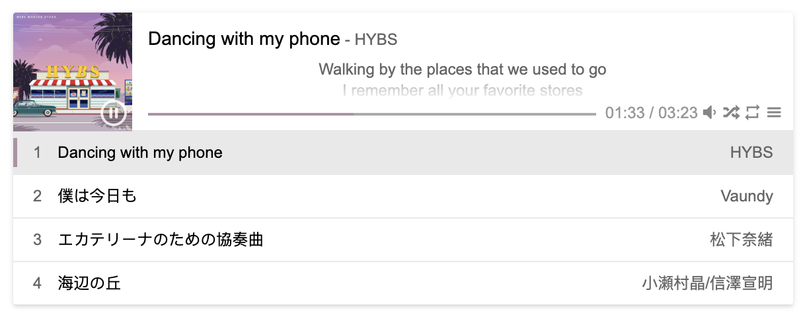

# aplayer-react

[APlayer](https://aplayer.js.org/) for your React application.


[](https://github.com/semantic-release/semantic-release)



View full documentation on https://aplayer-react.js.org

## Features

The APlayer features you love with the APlayer options you are familiar with.

- Beautiful and clean UI
- Lyrics scroll
- Playlist with repeat & shuffle controls
- Custom theme color / Self-adapting theme color

## Usage

Install `aplayer-react` npm package

    npm i aplayer-react

Import APlayer component from `aplayer-react` package, and import stylesheet.

```jsx
import { APlayer } from "aplayer-react";
import "aplayer-react/dist/index.css";

render(
  <APlayer
    audio={{
      name: "Dancing with my phone",
      artist: "HYBS",
      url: "https://music.163.com/song/media/outer/url?id=1969744125",
    }}
    autoPlay
  />
);
```

## Who uses aplayer-react?

[Doma's blog](https://doma.land) and [more](https://github.com/SevenOutman/aplayer-react/network/dependents)

## Related projects

- [APlayer](https://github.com/DIYgod/APlayer): Prior art
- [react-aplayer](https://github.com/sabrinaluo/react-aplayer): A React wrapper component of APlayer
